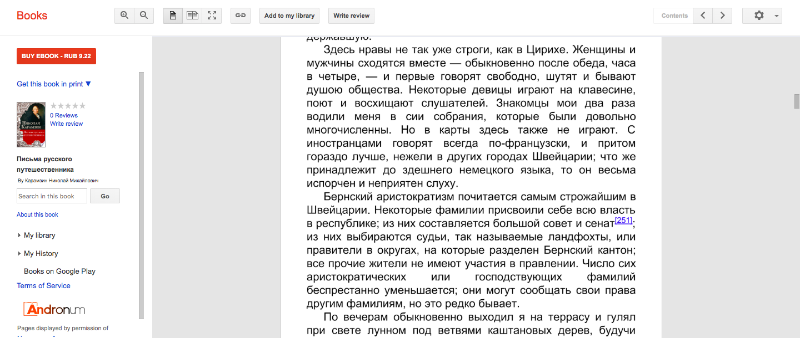
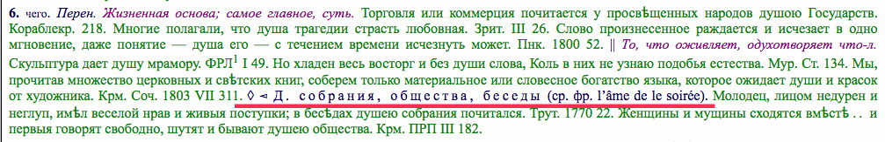
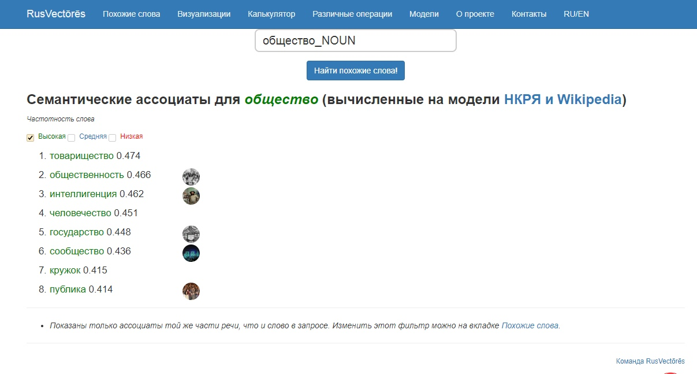
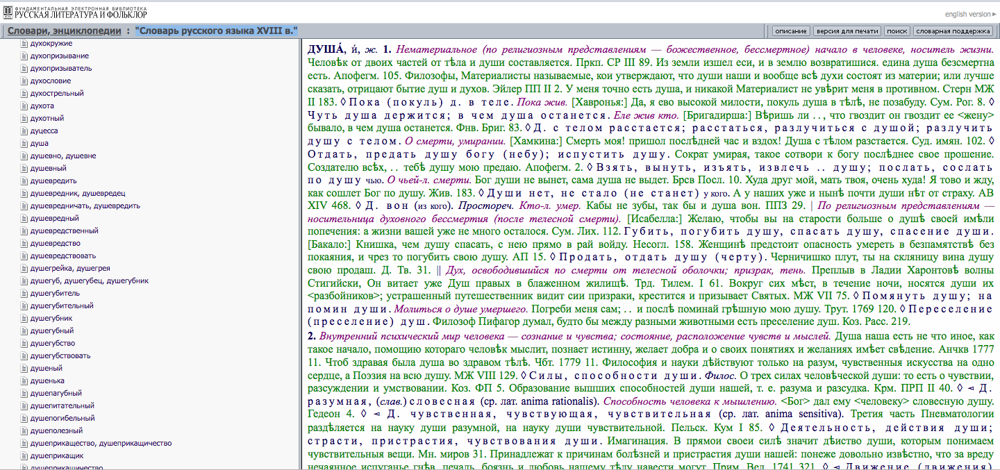
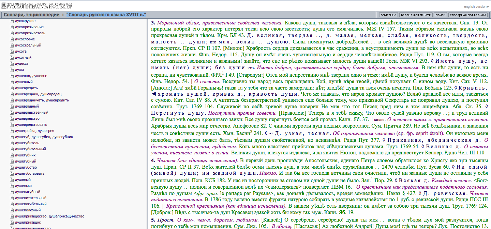
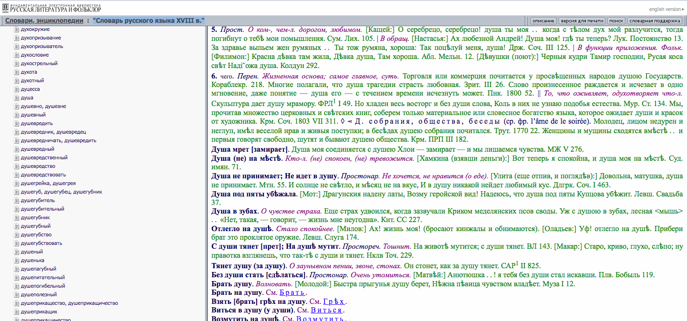
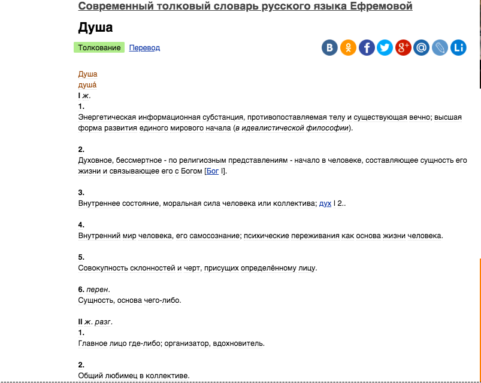
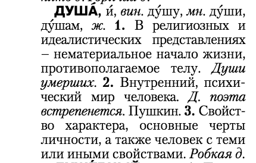
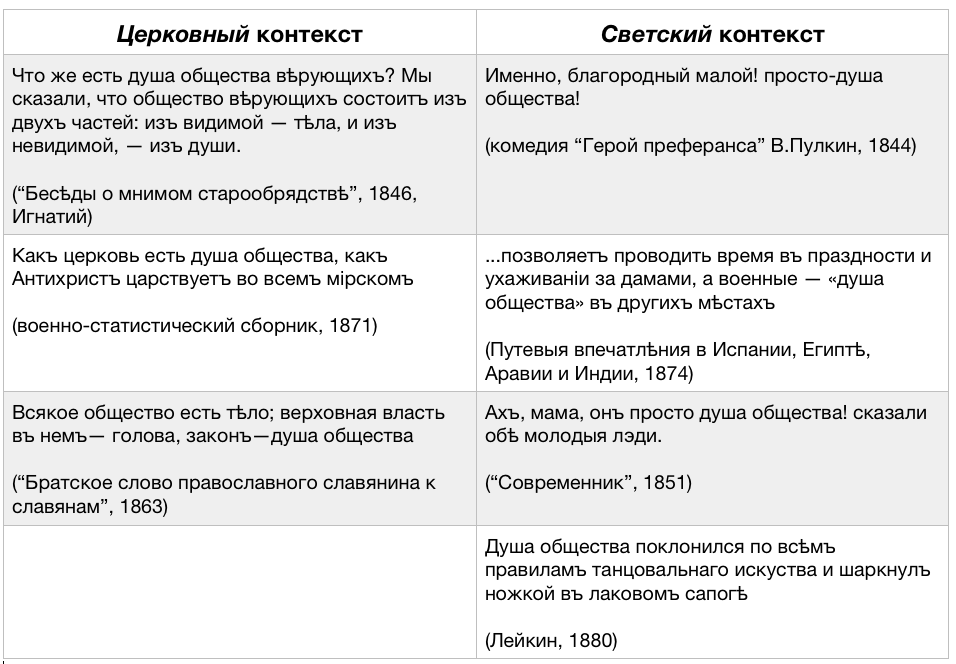

# [Эволюция понятия "душа общества" в XIX-XXI вв.](https://malikakoshka.github.io/towarish/)

Проект по Цифровой Грамотности 

## Вступление
  Предметом нашего исследования стал фразеологизм "душа общества". На наш взгляд, эволюция этого устойчивого сочетания отражает многочисленные историко-культурные изменения, произошедшие в русском обществе в период 18-21 вв. Безусловно, изучение  истории одного словосочетания, изменения его коннотативного значения и отражения этих смысловых сдвигов в литературе должно заслужить особое внимание среди молодых исследователей, в особенности среди поклонников погребения заживо, советской идеологии и конфессий христианства. 
  
  В качестве материала для нашей работы мы доверились выборке текстов Национального корпуса русского языка и Google Ngrams, которые содержат нужные нам словосочетания и являются наиболее показательными для исследования.
  
  Чтобы проследить семантическое изменение словосочетания "душа общества", мы прибегли к качественным и количественным методам исследования корпуса, с помощью которых были выявлены некоторые тенденции.
В работе мы использовали следующие инструменты:
* НКРЯ
* Google Ngrams
* RusVectores
* Google Books

## КАРАМЗИН - 18 век, путешествия, сатира и Трутень

Уже в 1780-ых годах можно встретить словосочетание "душа общества" в переносном, метафорическом значении. 
Читаем у Николая Михайловича Карамзина:
*Женщины и мущины сходятся вмѣстѣ .. и первыя говорят свободно, шутят и бывают душею общества.* 
(из "Писем русского путешественника", 1789-1790 гг.).

В данном примере словосочетание "душа общества" выступает в значении "вдохновитель, центральная личность", близкая к "народной" коннотации "весельчак, заводила" и т.п., которая появится позже.  

Первое упоминание, что нам удалось найти, было опубликовано на 20 лет ранее "Писем русского путешественника" Карамзина: 
*Молодец, лицом недурен и неглуп, имѣл веселой нрав и живыя поступки; в бесѣдах душею собрания почитался.*
1770 г. Сатирический журнал "Трутень" под ред. Новикова. 

Здесь появляется альтернатива словосочетанию "душа общества" -- "душа собрания". Мы можем сделать вывод, что в конце 18 века "душа общества" не воспринималась как устойчивое выражение и фразологизм, а была удачной характеристикой человека, чертой характера, которая либо была присуща кому-то, либо иногда проявлялась (как в случае с отрывком из Карамзина). Это подтверждает мобильность слова "общество", которое могло быть заменено на слово "собрание", "беседа" и т. п.

## АНÁСТАСИС - гроб, Гоголь, христианство и светская хроника

Совершенно иной пример употребления можно встретить в начале 19 века:
*Истина, которая натурально составляет право честного человека , есть душа общества* 
(Анáстасис, или Обязанности предупреждать возможность погребения живых, 1818 год).

Справка: Анáстасис с греч. - воскрешенный из мертвых. В XIX веке страх быть погребённым заживо стал достаточно распространённой фобией, получив даже имя тафофобия — от др.-греч. τάφος — гроб, могила и φόβος — страх. Начиная со второй половины XIX века и вплоть до 1934 года в странах Европы и Северной Америки патентовались и производились специальные «безопасные гробы», оборудованные средствами спасения для погребённых заживо. В Российской империи доподлинно известно, что тафофобия была у Н. В. Гоголя, в СССР - у М. Цветаевой.

Вероятнее всего, "душа общества" в этом документе употребляется отдельно от основного повествования и связана с погребением живого человека лишь косвенно. Мы как исследователи, не имеющие других необходимых текстовых материалов этого периода (1810-1820-е гг.), можем предположить, что в приведенном фрагменте "душа общества" употребляется в иносказательном смысле, но ещё не в качестве фразеологической единицы.

Примеры конца 18 века - начала 19-го говорят о важности слова "душа". Именно это слово остаётся неизменным. Вероятно, в Российской империи слово "душа" прежде всего употреблялось в связи с религиозными соображениями.
В [Словаре русского языка XVIII в.](http://feb-web.ru/feb/sl18/slov-abc/) представлены значения слова "душа" в порядке убывания - от самого употребляемого до наименее используемого.

Первое значение слова "душа" - *нематериальное (по религиозным представлениям — божественное, бессмертное) начало в человеке, носитель жизни.* И только последнее, шестое значение иносказательное, переносное - *перен. Жизненная основа; самое главное, суть.* Подобная семантическая иерархия представлена и в толковом словаре Ушакова, который был издан в 1935 году.
Однако примечательно, что в [Современном толковом словаре русского языка Ефремовой](https://dic.academic.ru/dic.nsf/efremova/161341) переносное значение этого слова выделено в отдельную группу.

В [Толковом словаре современного русского языка Д. Ушакова](http://enc.biblioclub.ru/Encyclopedia/241944_Tolkovyy_slovar_sovremennogo_russkogo_yazyka) слово "душа" имеет лишь три значения, в которые входит и иносказательное.

Таким образом уже сейчас мы можем сказать, что переносное значение стало широко употребимо во второй половине 20 века и по наши дни. Слово "душа" до сих пор имеет коннотацию начала всех начал в человеке, однако употребляется не так часто и ассоциируется скорее с качествами характера человека. (Добрая душа, льстивая душа и т.п.)

Итак, возвратимся к нашему словосочетанию. 

Далее примеры можно разделить тематически, поскольку явственно видны два контекста употребления фразеологизма - церковный и светский.

